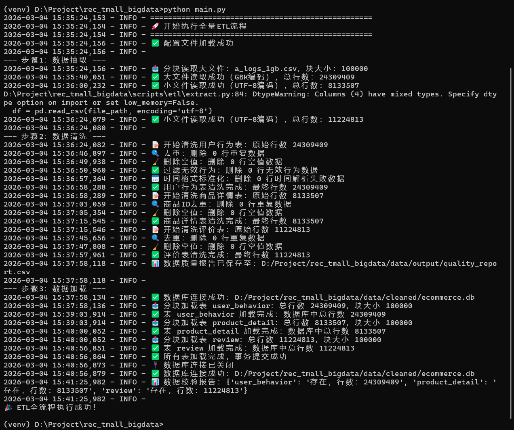
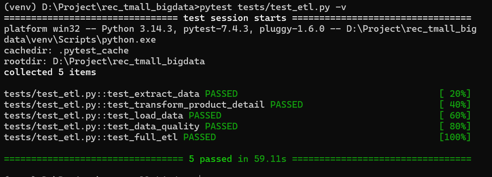
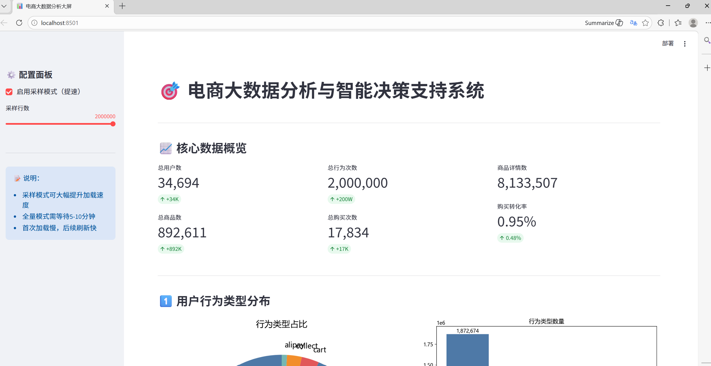
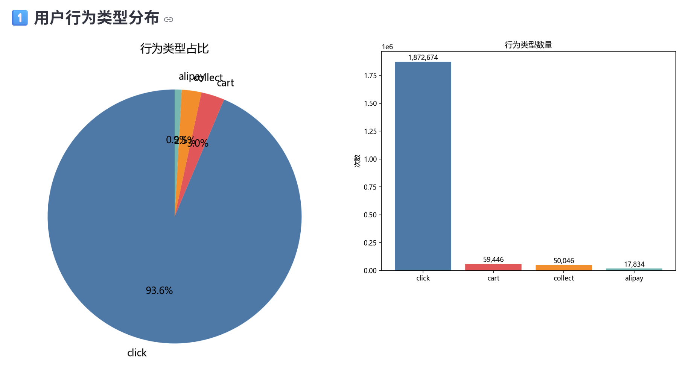
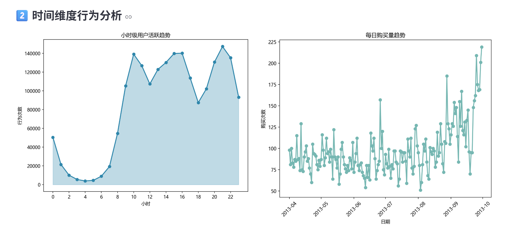
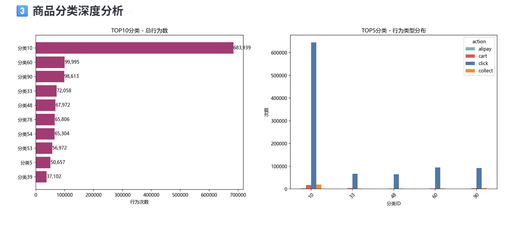
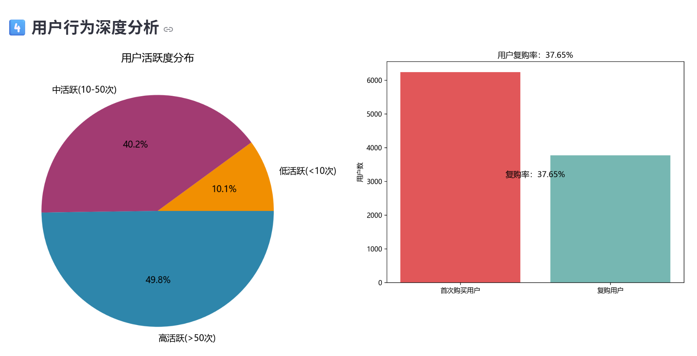
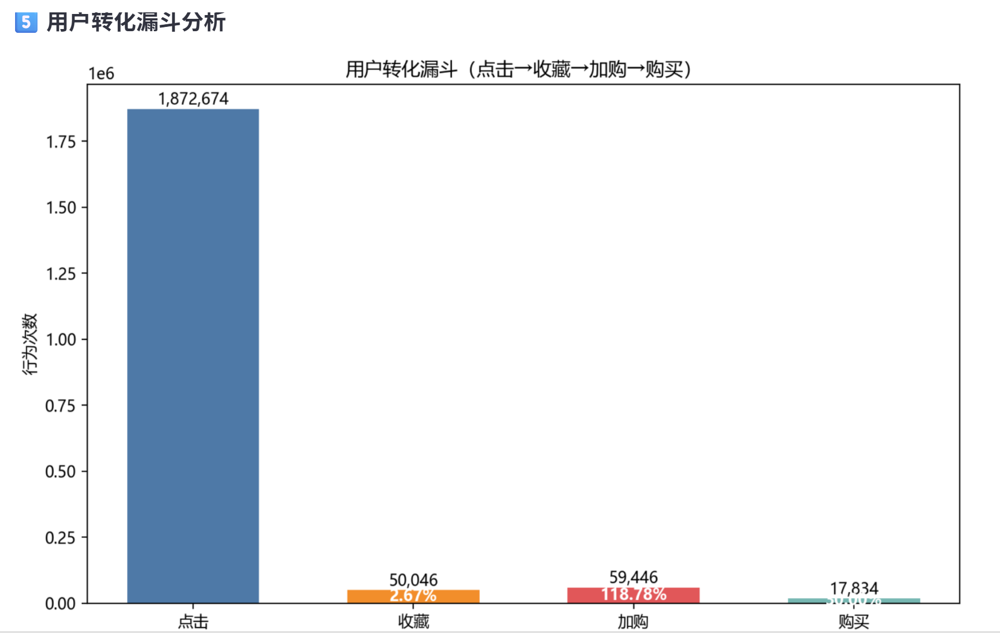

# 电商大数据分析与智能决策支持系统

基于天猫推荐数据集（Rec-Tmall）构建的企业级大数据分析项目，实现了从**数据抽取、清洗、加载**到**交互式可视化分析**的全链路工程化落地，覆盖电商数据核心分析维度，可为运营决策提供数据支撑。

## 🌟 项目亮点
- **工程化 ETL**：支持分块读取、增量过滤、数据质量校验，适配千万级大数据量处理
- **自动化测试**：基于 pytest 覆盖核心模块，保证数据处理流程稳定可靠
- **交互式可视化**：Streamlit 大屏支持采样模式/全量模式切换，多维度数据洞察
- **一键式部署**：main.py 主入口实现 ETL+可视化全流程一键执行

## 🛠️ 技术栈
| 模块         | 技术/工具                          |
|--------------|------------------------------------|
| 数据处理     | Python (Pandas, NumPy)             |
| 数据存储     | SQLite（轻量高效，适配中小规模数据） |
| ETL 开发     | 自定义模块化抽取/清洗/加载         |
| 自动化测试   | pytest                             |
| 可视化       | Streamlit、Matplotlib              |
| 开发环境     | Conda / Python venv                |

## 📊 核心功能
### 1. ETL 全流程
- **数据抽取**：支持多编码文件、分块读取、增量数据过滤
- **数据清洗**：自动去重、空值处理、格式校验，生成数据质量报告
- **数据加载**：分块写入 SQLite，支持数据完整性校验
# 

### 2. 自动化测试
- 覆盖抽取、清洗、加载核心模块
- 校验数据行数、字段完整性、空值率等关键指标
# 

### 3. 可视化大屏

包含 6 大核心分析维度：
- 核心数据概览（用户数、商品数、购买转化率等）
- 用户行为类型分布（点击/收藏/加购/购买）
# 
- 时间维度分析（小时级活跃趋势、每日购买量）
# 
- 商品分类深度分析（TOP10 分类、分类行为分布）
# 
- 用户活跃度与复购率分析
# 
- 转化漏斗分析（点击→收藏→加购→购买）
# 


## 🚀 快速开始

### 1. 环境准备
```bash
# 克隆仓库
git clone https://github.com/yzc2453/rec_tmall_analysis.git
cd rec_tmall_analysis

# 创建虚拟环境（可选）
python -m venv venv
# Windows 激活环境
venv\Scripts\activate
# Linux/Mac 激活环境
source venv/bin/activate

# 安装依赖
pip install -r requirements.txt -i https://pypi.tuna.tsinghua.edu.cn/simple
```

### 2. 数据准备
将原始数据集（用户行为日志、商品详情、评价数据）放入 `data/raw/` 目录，支持以下格式：
- 用户行为数据：`a_logs1.csv`
- 商品详情数据：`product.csv`
- 评价数据：`review.csv`

### 3. 一键执行 ETL+可视化
```bash
# 执行 ETL 全流程
python main.py

# ETL 完成后，根据提示输入 y 自动启动可视化大屏
# 或手动启动可视化：
cd scripts/visualization
streamlit run app.py
```

### 4. 运行自动化测试
```bash
# 执行所有测试用例
pytest tests/test_etl.py -v
```

## 📁 项目结构
```
rec_tmall_analysis/
├── data/                # 数据目录
│   ├── raw/             # 原始数据（本地存放，不上传GitHub）
│   ├── cleaned/         # 清洗后数据库文件
│   └── output/          # 日志、质量报告等输出文件
├── scripts/             # 核心代码
│   ├── etl/             # ETL 模块
│   │   ├── extract.py   # 数据抽取
│   │   ├── transform.py # 数据清洗
│   │   └── load.py      # 数据加载
│   └── visualization/   # 可视化大屏
│       └── app.py       # Streamlit 主文件
├── tests/               # 自动化测试用例
│   └── test_etl.py      # ETL 模块测试
├── main.py              # 项目主入口（一键执行）
├── requirements.txt     # 依赖清单
└── .gitignore           # Git 忽略配置
```

## 📈 核心数据洞察
1. **用户行为分布**：点击行为占比高达 93.6%，加购、收藏和支付占比极低，转化路径流失明显
用户行为高峰集中在 10–11 点、15–16 点、20–21 点，晚间 20–21 点为全天最活跃时段
2. **活跃规律**：用户行为高峰集中在 10–11 点、15–16 点、20–21 点，晚间 20–21 点为全天最活跃时段
3. **核心品类**：分类 10 行为量达 683,939 次，是平台核心品类；核心品类以点击为主，转化潜力巨大
4. **用户分层**：高活跃用户（>50 次）占比 49.8%，中活跃用户占 40.2%，用户复购率达 37.65%。
5. **转化漏斗**：点击→购买整体转化率约 0.95%，加购→购买转化率最高（30.0%），点击到加购 / 收藏流失最严重

## 📝 后续扩展方向
- 接入更多数据源（用户画像、地域数据）
- 增加机器学习模块（商品推荐、用户流失预警）
- 优化可视化大屏，支持数据导出、自定义筛选
- 迁移至 MySQL/PostgreSQL，适配更大规模数据

## ✨ 作者信息
- GitHub：[yzc2453](https://github.com/yzc2453)
- 项目地址：https://github.com/yzc2453/rec_tmall_analysis

## 📄 许可证
本项目采用 MIT 许可证，仅供学习交流使用。